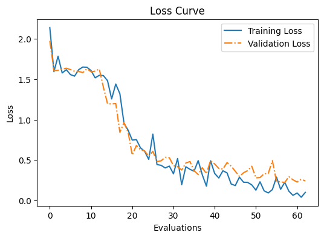
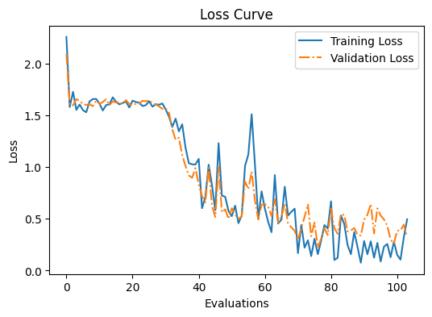
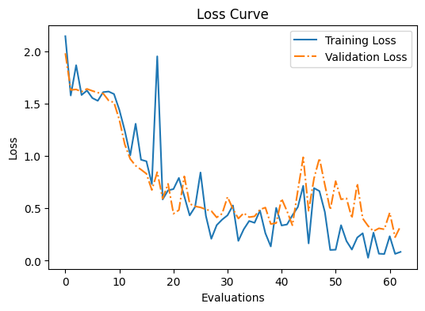

# アブレーション結果 — 更新ブロック数と最適化手法の網羅検証

この研究の中心的な問い「**事前学習済みモデルの、どこまでの層を更新すべきか**」に答えるための実験系列。
各行のノートブック名が、実験コード側のファイル名に対応する。

## 共通条件

| 項目 | 値 |
| :--- | :--- |
| モデル | GPT-2 small (124M) |
| クラス | 5クラス — Dickens / Doyle / Twain / Wells / Others |
| データ量 | 各クラス 2,500 件 = 計 12,500 件 |
| スニペット長 | 200 語 |
| 学習率 | 5e-5 |
| エポック | 3〜5（試行により異なる。表に最終エポックの値を併記） |
| 分類ヘッド | `Linear(768, 5)` |

以下、断りがなければ dropout 0.0・スケジューラなし。

---

## 1. 更新ブロック数を 1 → 6 まで動かす

| ノートブック | 更新範囲 | 備考 | Train | Val | **Test** |
| :--- | :--- | :--- | :---: | :---: | :---: |
| `bungo-124M-2-1` | 最終1ブロック | ベースライン | 76.25% | 80.00% | 76.29% |
| `bungo-124M-3-1` | 最終1ブロック | + パディング除外の修正 | 100.00% | 77.50% | 77.56% |
| `bungo-124M-3-2` | 最終2ブロック | | 96.25% | 80.00% | 81.32% |
| `bungo-124M-3-2-1` | 最終3ブロック | | 96.25% | 77.50% | 82.38% |
| `bungo-124M-3-2-2` | 最終4ブロック | | 96.25% | 90.00% | 84.78% |
| `bungo-124M-3-2-3` | **最終5ブロック** | | 96.25% | 86.25% | **85.67%** |
| `bungo-124M-3-2-4` | 最終6ブロック | | 93.75% | 80.00% | 83.05% |

### 読み取れること

**1ブロックから5ブロックまでは単調に上がり、6ブロックで下がる。**
76.29% → 85.67% と **9.4 ポイント**の差がつき、6ブロックでは 83.05% へ後退する。

慣例的な「最終1ブロックだけを訓練可能にする」という設計は、このタスクでは明確に不足していた。
一方で全層に近づければ良いわけでもなく、**最適値は 5 ブロック（あるいは 4 ブロック）に存在する**。

深い層ほどタスク固有の表現を持ち、浅い層ほど汎用的な言語構造を持つとすれば、
文体という比較的浅い特徴を捉えるには 5 ブロック分の深さが要る、
しかしそれ以上遡ると壊してはいけない汎用表現まで更新してしまう、という解釈になる。

*最終5ブロック解凍（Test 85.67%）。評価30回目付近で損失が大きく落ちる。*

## 2. 単体の正則化・スケジューラは 1 ブロックでは効かない

更新範囲を広げずに、スケジューラや dropout だけを足した場合。

| ノートブック | 更新範囲 | 追加した要素 | Train | Val | **Test** |
| :--- | :--- | :--- | :---: | :---: | :---: |
| `bungo-124M-2-1` | 最終1ブロック | （ベース） | 76.25% | 80.00% | 76.29% |
| `bungo-124M-3-3` | 最終1ブロック | コサインアニーリング | 73.75% | 73.75% | 72.53% |
| `bungo-124M-3-4` | 最終1ブロック | dropout 0.1 | 75.00% | 68.75% | 70.50% |

どちらもベースラインを**下回った**。
モデルの表現力が足りていない段階で正則化を足しても、足りないものがさらに減るだけだった。
ここが「まず更新範囲を広げる」という方針に切り替えた分岐点になっている。

## 3. 5 ブロック解凍を土台に最適化手法を振る

更新範囲を最終5ブロックに固定した上での比較。

| ノートブック | 追加した要素 | Train | Val | **Test** |
| :--- | :--- | :---: | :---: | :---: |
| `bungo-124M-3-2-3` | （5ブロックのみ・ベース） | 96.25% | 86.25% | 85.67% |
| `bungo-124M-4-1` | 学習率 2e-5 へ引き下げ | 97.50% | 85.00% | 85.59% |
| `bungo-124M-4-2` | ウォームアップ + コサイン | 97.50% | 81.25% | 84.36% |
| `bungo-124M-4-2-1` | ウォームアップのみ | 96.25% | 91.25% | 86.14% |
| `bungo-124M-4-2-2` | コサインのみ | 95.00% | 86.25% | 85.59% |
| `bungo-124M-4-2-3` | 勾配クリップ | 96.25% | 82.50% | 85.97% |
| `bungo-124M-4-2-3-2` | 勾配クリップ（閾値 5.0） | 97.50% | 86.25% | 85.97% |
| **`bungo-124M-4-3`** | **dropout 0.1** | 96.25% | 88.75% | **86.86%** |
| `bungo-124M-4-4` | ウォームアップ + クリップ0.5 + dropout0.1 | 90.00% | 88.75% | 84.70% |
| `bungo-124M-4-4-2` | ウォームアップ + dropout 0.1 | 91.25% | 85.00% | 84.11% |

### 読み取れること

**最良は dropout 0.1 単体の 86.86%。**

注目すべきは、同じ dropout 0.1 が **1ブロックでは 70.50%（ベース比 −5.8pt）、
5ブロックでは 86.86%（ベース比 +1.2pt）** と、逆の働きをしている点。
正則化が効くかどうかはモデルの更新範囲に依存し、単独では語れない。

もう一点、**手法を組み合わせるほど悪化している**。
dropout 単体 86.86% に対し、ウォームアップを足すと 84.11%、さらに勾配クリップも足すと 84.70%。
個別に効いた要素を足し合わせても加算にならず、むしろ互いの効果を打ち消した。

*最終5ブロック解凍 + dropout 0.1（Test 86.86%）。訓練損失と検証損失が最後まで大きく乖離しない。*

*勾配クリップを入れた試行（Test 85.97%）。評価40回目以降、訓練損失だけが下がり検証損失が上向いており、
テスト精度は出ているものの過学習が始まっている。*

---

## 結論

| 問い | 答え |
| :--- | :--- |
| 更新する層を増やすほど精度は上がるか | **上がらない。** 5ブロックが最適で、6ブロックでは後退する |
| 慣例の「最終1ブロックのみ」は妥当か | **このタスクでは不足。** 5ブロックとの差は 9.4 ポイント |
| 正則化やスケジューラは常に有効か | **更新範囲に依存する。** dropout 0.1 は1ブロックでは有害、5ブロックでは最良 |
| 有効な手法は足し合わせられるか | **足し合わせられない。** 単体より組み合わせの方が悪化した |

最終成績: **Test Accuracy 86.86%**（5クラス・GPT-2 124M・最終5ブロック解凍・dropout 0.1）

`figures/` の各 PNG はこの表のノートブック名に対応している。
